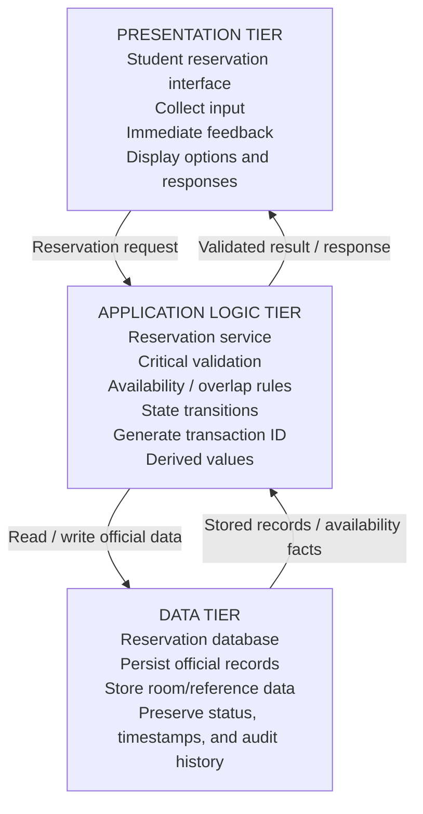

# Three-Tier Architecture — Study Room Reservation

## Architecture Diagram

## Major Responsibilities

### Presentation Tier
Responsible primarily for interaction with the student:
- Collect user input
- Display available options
- Provide immediate feedback
- Present success and error responses

### Application Logic Tier
Authoritative for transaction behavior:
- Critical validation
- Business rules
- State transitions
- Reservation conflict checking
- Transaction ID generation
- Derived values
- Coordination of database operations

### Data Tier
Responsible for the official persistent record:
- Store reservation records
- Store room/reference data
- Preserve status
- Preserve timestamps
- Preserve audit/history data

## Key Rule
Client-side checks may improve the user experience, but critical reservation rules must also be enforced in the application tier before the official record is saved.
