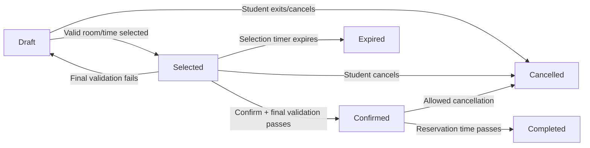

# State Transition Model — Study Room Reservation

## State Definitions

| State | Definition |
|---|---|
| Draft | The student has started entering reservation information, but no room/time has been committed. |
| Selected | A room and time have been chosen and are awaiting confirmation. |
| Confirmed | The reservation passed validation and has been stored as the official reservation. |
| Cancelled | The reservation was intentionally ended before use. |
| Expired | A temporary selection was not confirmed within the allowed period. |
| Completed | The reserved time has passed and the reservation is retained as historical record. |

## State Transition Diagram

## Allowed State Transitions

| Current State | Trigger | Who / What | Next State | Condition / Note |
|---|---|---|---|---|
| Draft | Valid room/time selected | Student + application | Selected | Requested slot is available. |
| Draft | Student exits/cancels | Student | Cancelled | No reservation is confirmed. |
| Selected | Student confirms | Student + application | Confirmed | Final validation passes. |
| Selected | Student cancels | Student | Cancelled | Cancellation occurs before confirmation. |
| Selected | Selection timer expires | System | Expired | Temporary selection is not confirmed in time. |
| Selected | Final validation fails | Application | Draft | Student must revise selection/request. |
| Confirmed | Student cancels before allowed cutoff | Student + application | Cancelled | Cancellation rule is satisfied. |
| Confirmed | Reservation time passes | System | Completed | Reservation is retained for history/audit. |

These state names describe persistent transaction conditions rather than workflow actions.
