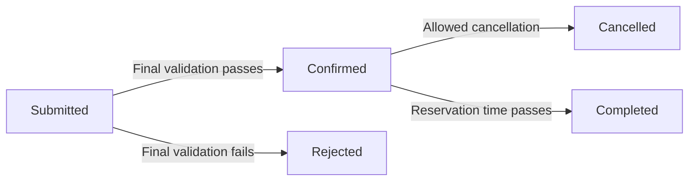

# State Transition Model — Study Room Reservation

## State Definitions

| State | Definition |
|---|---|
| Submitted | The student submitted the request, and the official transaction exists with a stable reservation ID while authoritative validation occurs. |
| Confirmed | The reservation passed validation and has been stored as the official reservation. |
| Rejected | The submitted request failed an availability, overlap, capacity, or time rule; the rejection reason is preserved. |
| Cancelled | A previously confirmed reservation was intentionally cancelled before its scheduled start time. |
| Completed | The reserved time has passed and the reservation is retained as historical record. |

## State Transition Diagram

## Allowed State Transitions

| Current State | Trigger | Who / What | Next State | Condition / Note |
|---|---|---|---|---|
| Submitted | Final validation passes | Application | Confirmed | Availability, overlap, capacity, and time rules all pass. |
| Submitted | Final validation fails | Application | Rejected | At least one authoritative rule fails, and a rejection reason is stored. |
| Confirmed | Student cancels before allowed cutoff | Student + application | Cancelled | Cancellation rule is satisfied. |
| Confirmed | Reservation time passes | System | Completed | Reservation is retained for history/audit. |

These five state names describe persistent transaction conditions rather than workflow actions. Data entry, room selection, and review are workflow actions that occur before the official `Submitted` transaction is created.
