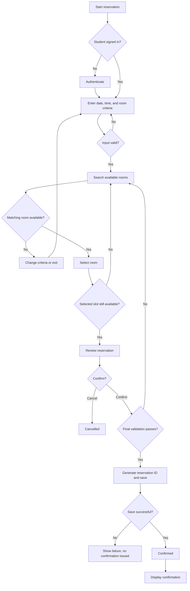

# Transaction Workflow — Study Room Reservation

## Trigger
A student needs a study room and starts a reservation request.

## Workflow Diagram

## Workflow Worksheet

| # | Actor | Action | Decision / Condition | Outcome / Next Step |
|---|---|---|---|---|
| 1 | Student | Opens the study room reservation system | Student is signed in? | If yes, continue. If no, authenticate before proceeding. |
| 2 | Student | Enters desired date, start time, end time, and room criteria | Are the requested values valid? | If valid, search availability. If invalid, show feedback and request correction. |
| 3 | System | Searches available study rooms | Is a matching room available? | If yes, display options. If no, follow the no-availability exception path. |
| 4 | Student | Selects an available room | Is the selected slot still available? | If yes, create a temporary selection. If no, refresh availability. |
| 5 | Student | Reviews reservation details | Confirm or cancel? | Confirm continues to final validation; cancel ends the request. |
| 6 | Application | Performs final validation | Does the reservation still satisfy business rules? | If yes, save the reservation. If no, follow the validation-failure path. |
| 7 | System | Generates reservation ID and stores official record | Save successful? | If yes, mark Confirmed and show confirmation. If no, follow the save-failure path. |
| 8 | System | Displays reservation confirmation | — | Transaction reaches confirmed outcome. |

## Decision Points
1. **Student signed in?**
2. **Input valid?**
3. **Room available?**
4. **Selected slot still available?**
5. **Confirm or cancel?**
6. **Final validation passed?**
7. **Save successful?**

## Exception / Failure Paths

### Exception 1 — No room available
Requested criteria do not match an available room.

**Path:** Search Requested → No Availability → student changes date/time or exits.

### Exception 2 — Slot becomes unavailable
Another transaction claims the same room/time before confirmation.

**Path:** Temporary Selection → Validation Failure → availability is refreshed → student chooses another option.

### Exception 3 — Save failure
The application cannot persist the official reservation record.

**Path:** Final Validation → Save Failure → no confirmation is issued → student is informed that the reservation was not completed.

## Outcome
A successful transaction ends with a confirmed study room reservation containing a stable reservation ID and persisted transaction record.
