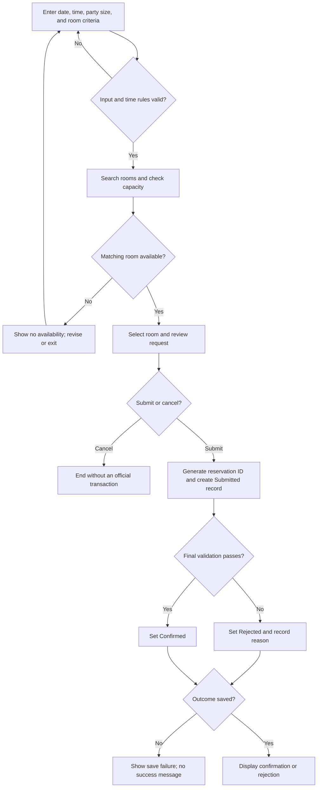

# Transaction Workflow — Study Room Reservation

## Trigger
A student needs a study room and begins a reservation request. Campus-login integration is outside scope, so the workflow assumes an authorized student identifier is already available.

## Workflow Diagram

## Workflow Worksheet

| # | Actor | Action | Decision / Condition | Outcome / Next Step |
|---|---|---|---|---|
| 1 | Student | Enters desired date, start time, end time, party size, and room criteria | Are the requested values usable and within time rules? | If valid, search availability. If invalid, show feedback and request correction. |
| 2 | System | Searches rooms and checks capacity for the requested interval | Is a matching room available? | If yes, display options. If no, follow the no-availability exception path. |
| 3 | Student | Selects a room and reviews the reservation details | Submit or cancel? | Submit creates an official request; cancel ends without an official transaction. |
| 4 | Application | Generates a stable reservation ID and creates the official record | Was the request created successfully? | If yes, set status to Submitted and continue. If no, report a save failure. |
| 5 | Application | Performs final availability, overlap, capacity, and time-rule validation | Do all authoritative rules pass? | If yes, continue to confirmation. If no, continue to rejection. |
| 6 | Application | Assigns the official outcome | Which validation result applies? | Set Confirmed when all rules pass; otherwise set Rejected and record the reason. |
| 7 | Data tier | Persists the outcome, timestamps, and audit information | Was the outcome saved? | If yes, return the stored result. If no, follow the save-failure path. |
| 8 | System | Displays the transaction result | — | Show the reservation ID with either confirmation or the rejection reason. |

## Decision Points
1. **Input and time rules valid?**
2. **Matching room available with sufficient capacity?**
3. **Submit or cancel?**
4. **Official request created successfully?**
5. **Final validation passed?**
6. **Outcome saved successfully?**

## Exception / Failure Paths

### Exception 1 — No room available
Requested criteria do not match an available room.

**Path:** Search Requested → No Availability → student changes date/time, party size, or room criteria, or exits. No official transaction is created.

### Exception 2 — Slot becomes unavailable
Another transaction claims the same room/time before confirmation.

**Path:** Submitted → Final Validation Failure → Rejected → rejection reason and timestamps are preserved.

### Exception 3 — Save failure
The application cannot create the official request or persist its final outcome.

**Path:** Create/Update Record → Save Failure → no success message is issued → student is informed that the transaction could not be completed.

## Outcome
A submitted transaction ends with a persisted `Confirmed` or `Rejected` status. Both outcomes retain the stable reservation ID, timestamps, and audit information; a rejected transaction also retains its rejection reason.
